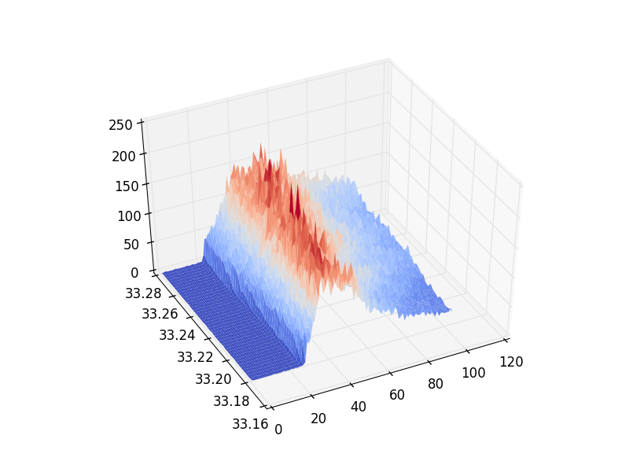

# jason2

A Python package for downloading and working with [jason2 altimitry data](http://www.nasa.gov/mission_pages/ostm/main/).
**jason2** includes a command line tool for common use cases.


## Installation

Install via `pip` from github:

```bash
pip install git+https://github.com/gadomski/jason2.git@master
```
**jason2** depends on [netCDF4](https://github.com/Unidata/netcdf4-python), which requires [hdf5](http://www.hdfgroup.org/HDF5) and [netcdf](http://www.unidata.ucar.edu/software/netcdf).
If you run OSX, both are available with [homebrew](http://brew.sh).

```bash
brew install hdf5 netcdf
```

**jason2** was developed on OSX, so it should work out of the box on most \*nix's.
Windows, your mileage my vary.

**jason2** was developed on Python 2.7.9.


## Common Usage

What can **jason2** do for you?
Here's one example.

```bash
$ cat > jason2.cfg
[project]
data_directory: build
email: me@example.com
products: gdr, sgdr

[pass-195]
min_latitude = 32.98
max_latitude = 33.23

$ jason2 fetch
# ... lots of output ...

$ ls build
gdr_d  sgdr_d

$ ls build/sgdr_d/cycle_000
JA2_GPS_2PdP000_195_20080709_170712_20080709_180325.nc  JA2_GPS_2PdP000_195_20080709_170712_20080709_180325.zip

$ jason2 plot-waveforms 0
# ... 3d waveform plot of sdgr cycle 0 appears ...
```




## Documentation

Documentation is hosted at http://gadomski.github.io/jason2.
The plain text docs are available in this source tree at `docs/index.md`.


## License

This code is available under the MIT license, see LICENSE.txt.
